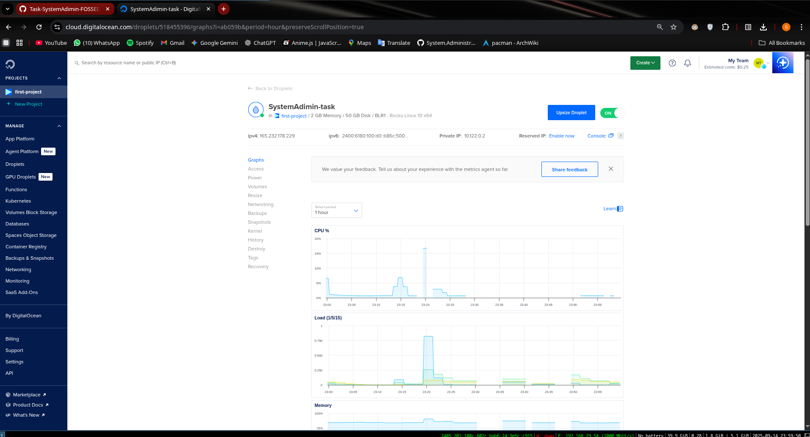
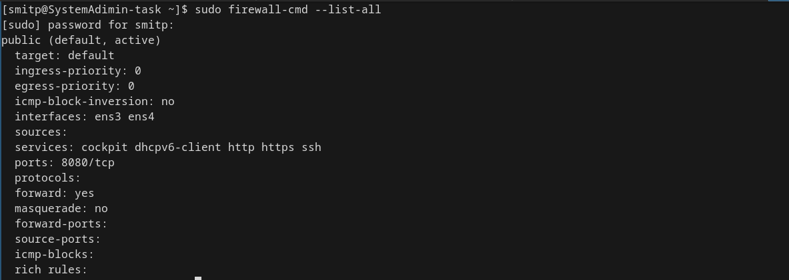
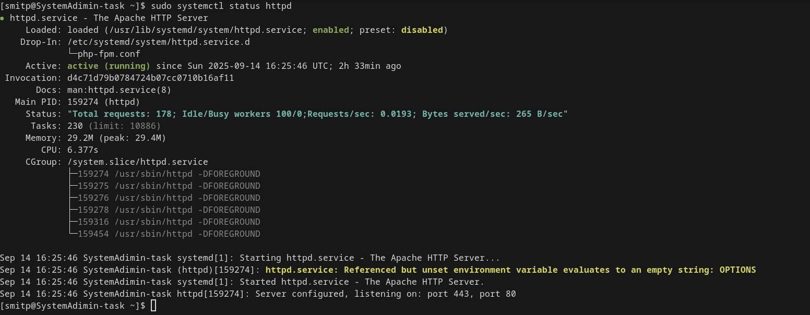
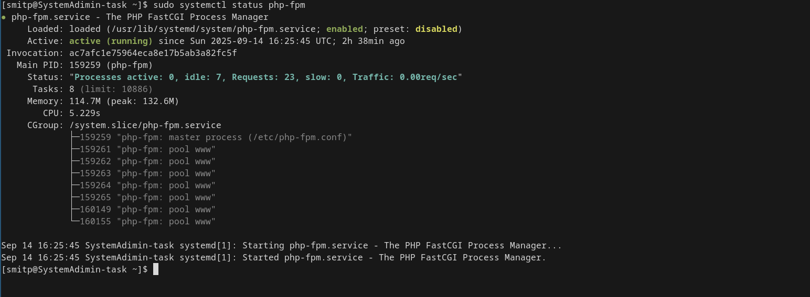
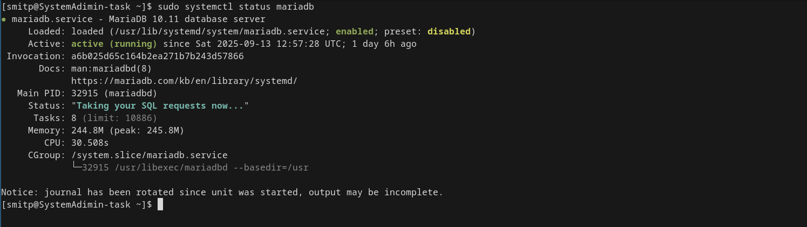

# Page 1: Infrastructure & Keycloak Foundation

## 1. Digital Ocean Droplet & Initial Setup

First, we'll create the server and perform essential security hardening.

**A Note on Placeholders:** Throughout this guide, you'll see placeholders like `your_droplet_ip`, `your_username`, and `your_domain.com`. Remember to replace these with your actual values.

### A. Create the Droplet:

1.  Log in to your Digital Ocean control panel.
2.  Click **Create > Droplets**.
3.  **Operating System:** Choose Rocky Linux 10.
4.  **Plan:** Select a plan that meets your needs (e.g., Basic Shared CPU with 2GB+ RAM).
5.  **IP:** IPv6 should be enabled along with IPv4.
6.  **Datacenter:** Choose a region close to your users.
7.  **Authentication:** Add your SSH key. This is more secure than using a password.
8.  **Finalize:** Set a hostname and click **Create Droplet**.



### B. Initial Server Hardening:

1.  Connect to your new Droplet as the `root` user.
    ```bash
    ssh root@your_droplet_ip
    ```
2.  Create a new user and grant administrative privileges.
    ```bash
    # Create the user and set a strong password
    adduser your_username
    passwd your_username

    # Add the user to the 'wheel' group to grant sudo access
    usermod -aG wheel your_username
    ```
3.  Copy your SSH key to the new user to allow direct SSH access.
    ```bash
    # Copy SSH key for passwordless login
    rsync --archive --chown=your_username:your_username ~/.ssh /home/your_username
    ```
4.  Disable root SSH login for better security. Edit `/etc/ssh/sshd_config` and change `PermitRootLogin yes` to `PermitRootLogin no`.
5.  Apply the change.
    ```bash
    sudo systemctl restart sshd
    ```
6.  Log out and log back in as your new user: `ssh your_username@your_droplet_ip`.

### C. Configure the Firewall:

```bash
# Enable and start the firewall
sudo systemctl enable --now firewalld

# Allow essential services permanently
sudo firewall-cmd --permanent --add-service=http
sudo firewall-cmd --permanent --add-service=https
sudo firewall-cmd --permanent --add-port=8080/tcp # For Keycloak
sudo firewall-cmd --permanent --add-service=ssh

# Apply the new rules
sudo firewall-cmd --reload
```



### D. Update System & Install Core Components:

```bash
# Update all system packages
sudo dnf update -y

# Install EPEL and Remi repositories for up-to-date packages
sudo dnf install epel-release -y
sudo dnf install https://rpms.remirepo.net/enterprise/remi-release-10.rpm -y
sudo dnf module enable php:remi-8.3 -y

# Install Apache, PHP, MariaDB, Python, and other tools
sudo dnf install httpd php php-cli php-mysqlnd php-gd php-xml php-mbstring php-json php-fpm mariadb-server python3 python3-pip unzip wget -y

# Enable and start core services
sudo systemctl enable --now httpd
sudo systemctl enable --now php-fpm
sudo systemctl enable --now mariadb
```



